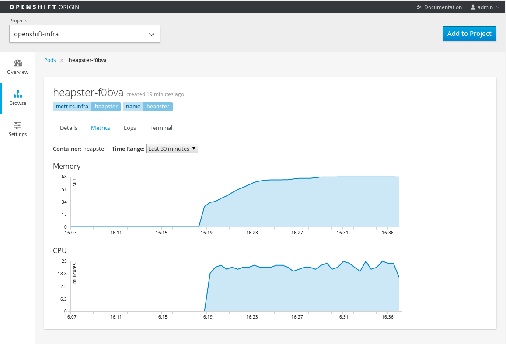

= origin-metrics

[NOTE]
====
This document and its corresponding contianers are meant to run on version v1.0.8 or later of link:https://github.com/openshift/origin[OpenShift Origin]
====

The following document will describe how to build, configure and install the metric components for OpenShift.

The metric components will gather metrics for all containers and nodes across an entire OpenShift cluster. As such it needs to be performed by a cluster administrator.

== Overview

There are three main components to the metrics gathering:

=== Heapster

link:https://github.com/kubernetes/heapster[Heapster] is the component which gathers the various metrics from the OpenShift cluster. It connects to each node in an OpenShift cluster and reads the kubelet's `/stats` endpoint to retrieve metrics.

It retrieves cpu and memory metrics for every container running in the cluster, across all namespaces. It also retrieves metrics for the node itself, the kubelet, and the docker daemon.

Heapster does not store metrics itself and requires sending the metrics to another component for storage. For this setup, the component which deals with historically saved metrics is Hawkular Metrics.

==== Hawkular Metrics
link:https://github.com/hawkular/hawkular-metrics/[Hawkular Metrics] is the metric storage engine from the link:http://www.hawkular.org/[Hawkular] project. It provides means of creating, accessing and managing historically stored metrics via an easy to use json based REST interface.

Heapster sends the metrics it receives to Hawkular Metrics over the Hawkular Metric REST interface. Hawkular Metrics then stores the metrics into a Cassandra database.

==== Cassandra

link:http://cassandra.apache.org/[Cassandra] is the database used to store the gathered metrics.

== Building the Docker Containers

All the docker images for Origin Metric components are available at link:https://hub.docker.com/search/?q=openshift%2Forigin-metrics&page=1&isAutomated=0&isOfficial=0&starCount=0&pullCount=0[docker hub] and there should not be a need to build these directly.

If you wish to build your own images or hack on the project. Please see the link:docs/build.adoc[build instructions].

== Before You Begin

The Metrics components requires that OpenShift is properly installed and configured. How to properly install and configure OpenShift is beyond the scope of this document. Please see the link:https://docs.openshift.org/latest/welcome/index.html[OpenShift documentation] on how to properly install and setup your system.

There are a few things which you will specifically need to make sure are properly configured with your OpenShift instance:

. The link:docs/troubleshooting.adoc#checking-if-the-dns-service-is-running-or-not[OpenShift DNS server] needs to be properly running on your system.

. link:docs/troubleshooting.adoc#empty-charts[Node certificate problems] if your OpenShift installation was originally installed on an older version.

. SELinux and firewall configurations may cause problems if not properly configured.

Please see the link:docs/troubleshooting.adoc[troubleshooting guide] for a complete list of things to watch out for.

== Deploying the Origin Metrics Components

[NOTE]
====
In order to use the horizontal pod autoscaler (HPA), all of the metric components will need to be deployed to the `openshift-infra` project.
====

=== Create the Deployer Service Account

A pod is used to setup, configure and deploy all the various metric components. This deployer pod is run under the `metrics-deployer` service account.

The `metrics-deployer` can be created from the link:metrics-deployer-setup.yaml[*_metrics-deployer-setup.yaml_*] configuration file. The following command will create the service account for you:

----
$ oc create -f metrics-deployer-setup.yaml -n openshift-infra
----

=== Metrics Deployer Service Account

In order to deploy components within the project, the `metrics-deployer` service account needs to be granted the 'edit' permission.

This can be accomplished by running the following command:

----
$ oadm policy add-role-to-user edit \
        system:serviceaccount:openshift-infra:metrics-deployer \
        -n openshift-infra
----

=== Heapster Service Account

The heapster component requires accessing the kubernetes node to find all the available nodes as well as accessing the `/stats` endpoint on each of those nodes. This means that the `heapster` service account which requires having the `cluster-reader` permission.

The following command will give the `heapster` service account the required permission:

----
$ oadm policy add-cluster-role-to-user cluster-reader \
        system:serviceaccount:openshift-infra:heapster \
        -n openshift-infra
----

=== Create the Metrics Deployer Secret

By default, the *metrics deployer* auto-generates self-signed certificates for
use between components. To provide your own certificates, you can pass these
values as secrets to the *metrics deployer*.

[WARNING]
====
By default, the Hawkular Metrics service uses self signed certificates which can
cause problems when the console accesses it in a web browser. Alternately, you
can specify your own *_hawkular-metrics.pem_* secret to use a certificate which
is trusted by the browser.

When supplying your own certificate for the Hawkular Metrics service it *must* contain both the hostname specified for the route as well as the internally used `hawkular-metrics` hostname.
====

For instance, to optionally provide your own certificates for Hawkular Metrics, you can point your secret to the certificate's *_.pem_* and certificate authority file:

----
$ oc secrets new metrics-deployer hawkular-metrics.pem=/home/openshift/metrics/hm.pem \
hawkular-metrics-ca.cert=/home/openshift/metrics/hm-ca.cert -n openshift-infra
----

If you wish to use the autogenerated certificates instead, you will just need to generate an empty secret:

----
$ oc secrets new metrics-deployer nothing=/dev/null -n openshift-infra
----

For a full listing of all the available secrets for the Origin Metrics deployer, please see the link:docs/deployer_configuration.adoc#deployer-secrets[deployer configuration] page.

=== Deploying Only Heapster

If you do not wish to deploy the Hawkular Metrics and Cassandra containers, it is possible to just deploy the Heapster components in a stand alone manner.

If you do wish to deploy all the metrics components and have access to metric graphs in the OpenShift console, please continue to the link:#deploying-all-of-the-metrics-components[Deploying all of the Metrics Components] section.

[WARNING]
====
The OpenShift console uses Hawkular Metrics for its graphing capabilities. If you only deploy Heapster you will not be able to view any metrics in the console.
====

The Heapster deployer template does not have an required parameters and will fallback to defaults. For a full list of parameters options please see the link:docs/deployer_configuration.adoc#deployer-template-parameters[deployer configuration] page.

You should only run the following command if you are sure that you only want the Heapster component to be deployed:

----
$ oc process -f heapster-standalone.yaml | oc create -n openshift-infra -f -
----	

=== Deploying all of the Metrics Components

==== Persistent Storage

You can deploy the metrics components with or without persistent storage.

Running with persistent storage means that your metrics will be stored to a link:https://docs.openshift.org/latest/architecture/additional_concepts/storage.html[persistent volume] and be able to survive a pod being restarted or recreated. This requires an admin to have setup and made available a persistent volume of sufficient size. Running with persistent storage is highly recommended if you require metric data to be guarded against data loss. Please see the link:docs/persistent_storage.adoc[persistent storage] page for more information.

Running with non-persistent storage means that any stored metrics will be deleted when the pod is deleted or restarted. Metrics will still survive a container being restarted. It is much easier to run with non-persistent data, but with the tradeoff of potentially losing this metric data. Running with non-persistent data should only be done when data loss under certain situations is acceptable.

[IMPORTANT]
====
When using persistent storage you will need to make sure that your storage size is appropriate for your needs. The Cassandra database can and will use up all the available space allocated to the Persistent Volume which will cause serious errors.

Metric data expires based on the *METRICS_DURATION* template parameter. Normally this means that older data is being removed at about the same pace as newer data arrives. You will still need to monitor your data usage to make sure that changes to your cluster have not caused your usage to increase beyond what your persistent volume will be able to handle.
====

==== Deployer Template

To deploy the metric components, you will need to deploy the 'metrics' template.

The only required template parameter is `HAWKULAR_METRICS_HOSTNAME`. This parameter specifies the hostname that hawkular metrics is going to be hosted under. This is used to generate the Hawkular Metrics certificate and is used for the host in the route configuration.

For the full list of deployer template options, please see the link:docs/deployer_configuration.adoc#deployer-template-parameters[deployer configuration] page.

[NOTE]
====
The following options assume that the kubernetes master will be available under `https://kubernetes.default.svc:443` if this is not the case please set the link:docs/deployer_configuration.adoc#deployer-template-parameters[MASTER_URL]. Failure to properly set this may result in strange i/o timeout errors in the deployer logs.
====

If you are using non-persistent data, the following command will deploy the metric components without requiring a persistent volume to be created before hand:

----
$ oc process -f metrics.yaml -v \
     HAWKULAR_METRICS_HOSTNAME=hawkular-metrics.example.com,USE_PERSISTENT_STORAGE=false \
     | oc create -n openshift-infra -f -
----	
	
If you are using persistent data, the following command will deploy the metric components but requires a storage volume of sufficient size to be available:

----
$ oc process -f metrics.yaml -v \
     HAWKULAR_METRICS_HOSTNAME=hawkular-metrics.example.com,USE_PERSISTENT_STORAGE=true \
     | oc create -n openshift-infra -f -
----     

[NOTE]
====
If you ever wish to undeploy and then redeploy all the metric components, you can do so by setting the `MODE` template parameter to 'redeploy'. Note that this will also remove any persistent volume claims and any persisted data will be lost.
Any non persisted data will be lost as well. This is equivalent to deleting all the components and then restarting everything overagain.

For example:
----
$ oc process -f metrics.yaml -v \
     HAWKULAR_METRICS_HOSTNAME=hawkular-metrics.example.com,USE_PERSISTENT_STORAGE=false,MODE=redeploy \
     | oc create -n openshift-infra -f -
----

The `refresh` value for `MODE` performs the same steps as 'redeploy' but the persistent volume claims and route will not be deleted. Any non-persisted data will be lost with this operation. This option is useful if you wish
to redeploy your components with updated deployer secrets or if you wish to deploy another newer version.

For example:
----
$ oc process -f metrics.yaml -v \
     HAWKULAR_METRICS_HOSTNAME=hawkular-metrics.example.com,USE_PERSISTENT_STORAGE=false,MODE=refresh \
     | oc create -n openshift-infra -f -
----

To manually delete the pvc and route, you can run the following command:

----
$ oc delete pvc --selector="metrics-infra"
$ oc delete route --selector="metrics-infra"
----
====

== Verifying the Components after Installation

The first check should always be to see that the Hawkular Metrics, Cassandra, and Heapster pods are in the running state.

----
$ oc get pods -n openshift-infra
----

If all pods are in the running state, then you will want to check the Hawkular-Metrics status page:

----
$ curl -X GET https://${HAWKULAR_METRICS_HOSTNAME}/hawkular/metrics/status
----

This will return a short json document. The important thing to look at here is the `MetricsService` value, if this is `STARTED` then it means that Hawkular Metrics has fully started and was able to successfully connect to Cassandra.

The next step will be to check the Heapster validate page. The link:#accessing-heapster-directly[Accessing Heapster Directly] section fully describes how to connect to this page. This page will show you some information about the current Heapster setup as well as how many metrics it knows about and has written into Hawkular Metrics.

Please see the link:docs/troubleshooting.adoc[troubleshooting guide] if you are running into any issues.

== Configurations for the OpenShift Console

The OpenShift web console uses the data coming from the Hawkular Metrics service
to display its graphs. The URL for accessing the Hawkular Metrics service
must be configured via the `*metricsPublicURL*` option in the *_master-config.yaml_*
file. This URL corresponds to the route created with the
`*HAWKULAR_METRICS_HOSTNAME*` template parameter during the
link:#deploying-the-metrics-components[deployment]
of the metrics components.

[NOTE]
====
You must be able to resolve the `*HAWKULAR_METRICS_HOSTNAME*` from the browser
accessing the console.
====

For example, if your `*HAWKULAR_METRICS_HOSTNAME*` corresponds to `hawkular-metrics.example.com`, then you must make the following change in the *_master-config.yaml_* file:

====
[source,yaml,]
.master-config.yaml
----
  assetConfig:
    ...
    metricsPublicURL: "https://hawkular-metrics.example.com/hawkular/metrics"
----
====

Once you have updated and saved the *_master-config.yaml_* file, you must
restart your OpenShift instance.

When your OpenShift server is back up and running, metrics will be displayed on
the pod overview pages.

== Accessing Metrics Directly

If you wish to access and manage metrics directly, you can do so via the Hawkular Metrics REST API. This will allow you to directly access the raw metrics data and export it for use in your own customized systems.

For more information please see the link:docs/hawkular_metrics.adoc[Hawkular Metrics] page.

== Accessing Heapster Directly

The Heapster deployed as part of origin-metrics is configured to be only accessible via the API Proxy. Access will require either cluster-reader or cluster-admin privileges.

For example, to reach the Heapster `metrics` endpoint, you would need to access it by doing something like:

----
$ curl -H "Authorization: Bearer XXXXXXXXXXXXXXXXX" \
       -X GET https://${KUBERNETES_MASTER}/api/v1/proxy/namespaces/openshift-infra/services/https:heapster:/api/v1/model/metrics
----

For more information about Heapster and how to access its APIs, please refer the link:https://github.com/kubernetes/heapster/[Heapster] project.

== Cleanup

If you wish to undeploy and remove everything deployed by the deployer, the follow commands can be used:

----
$ oc delete all --selector=metrics-infra -n openshift-infra
$ oc delete secrets --selector=metrics-infra -n openshift-infra
$ oc delete sa --selector=metrics-infra -n openshift-infra
$ oc delete templates --selector=metrics-infra -n openshift-infra
----

[NOTE]	
====
The persistent volume claim will not be deleted by the above command. If you wish to permanently delete the data in persistent storage you can run `oc delete pvc --selector=metrics-infa`
====

If you wish to remove the deployer's components themselves

----
$ oc delete sa metrics-deployer -n openshift-infra 
$ oc delete secret metrics-deployer -n openshift-infra
----

== Known Issues

Please see the link:docs/known_issues.adoc[known issues] page in the documentation.
