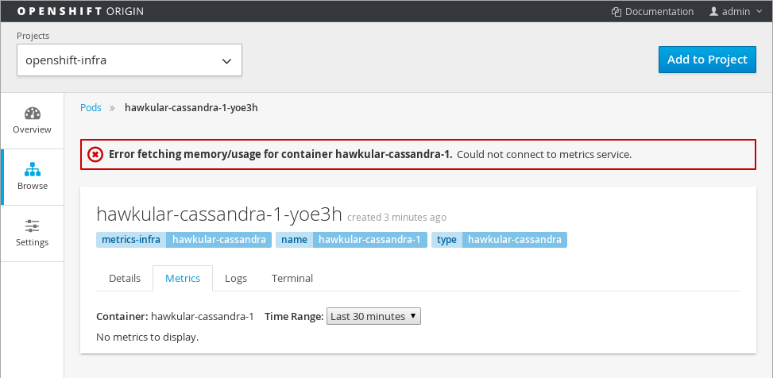
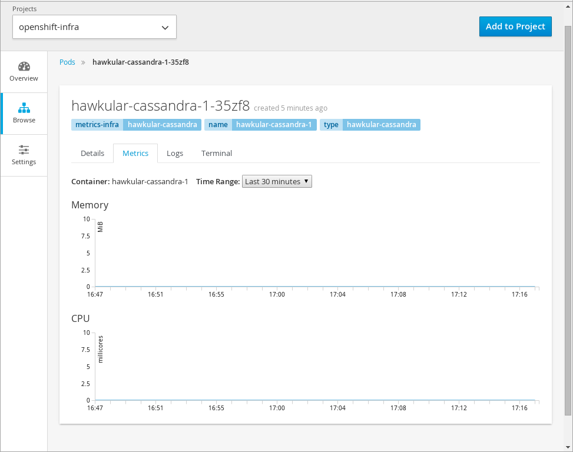

# Troubleshooting

## OpenShift DNS Server

OpenShift should under normal situations start a DNS server which is used by components to discover services. If for some reason the DNS server could not be started, then you may encounter all sorts of issues where DNS hostnames not being resolveable.

### Checking if the DNS Service is running or not

You can run the following command to see if the OpenShift DNS server is running and can resolve the `kubernetes.default.svc.cluster.local` hostname. 

You will need to replace `$OPENSHIFT_MASTER` with the hostname or IP address of where your OpenShift master is running. The following example assumes the default DNS domain of `cluster.local` is being used.

----
dig @$OPENSHIFT_MASTER +short kubernetes.default.svc.cluster.local
----

If the command returns an IP address, then OpenShift's DNS server should have started properly.

If not, then it means you will need to check the OpenShift logs for the cause of the error.

A common error for the DNS server not starting is because there is already an DNS server running on the machine. If this is the case, the following warning will be in the OpenShift logs:

----
Could not start DNS: listen tcp4 0.0.0.0:53: bind: address already in use
----

## Console

### Could Not Connect to Metrics Service

If you open the console and experience the "Could not connect to metric service" error:

This error means that the browser could not connect to the Hawkular Metrics service. Usually this means that either the browser cannot resolve the hostname for the Hawkular Metrics route or it does not trust the certificate for the Hawkular Metrics service.

To check if this is an issue with the DNS resolution. Open a browser tab to the value specified as `metricsPublicURL` in the *_master-config.yaml_* configuration file.

[NOTE]
====
Just a reminder that the `metricsPublicURL` needs to be in the format `https://${HAWKULAR_METRICS_HOSTNAME}/hawkular/metrics`. It must specify that it is to use `https` and that the path ends with `/hawkular/metrics`
====

If you cannot access the Hawkular Metrics page from that URL then your router is not properly configured or the system the browser is running on is not configured to resolve the route's hostname.

If you receive an error in the browser about an `untrusted connection` or `the connection not being private` then it usually means the certificate for the service is not trusted by the browser. If you are using the default self signed certificates, then this type of error is expected.

If fix your certificate problem, or verify that you do in fact trust the certificate, then metrics should start appearing in the console.

### Empty Charts

When the metrics components are first deployed, the charts may be empty while the metric data is populated to the Hawkular Metrics system. This should normally take less than a minute. If the charts remain empty, then there is probably a problem with the Heapster component.

Persistent empty charts usually mean that Heapster was unable to get metrics from the OpenShift cluster. The likely culprit for this is an issue which can arise from updating from a pervious OpenShift cluster and where the node certificates are missing IP SAN information. Please see 
link:https://github.com/mwringe/openshift-docs/blob/node_certificates/install_config/upgrades.adoc#openshift-origin-pre-108-installation-and-kubelet-certificates[OpenShift update documentation] for more details and how to remedy the issue
